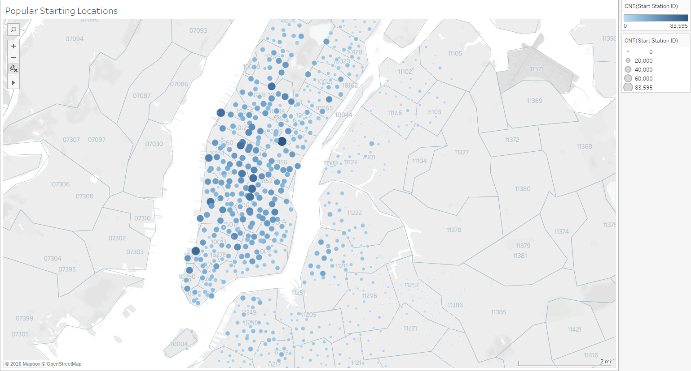
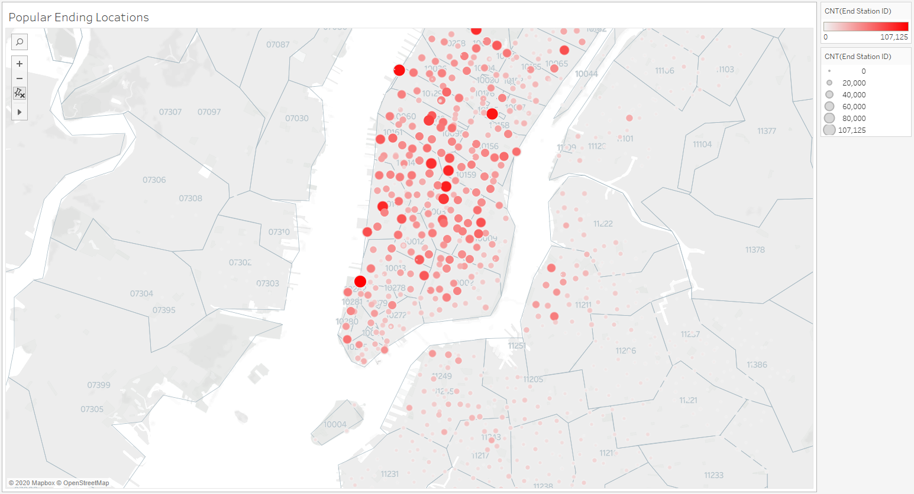
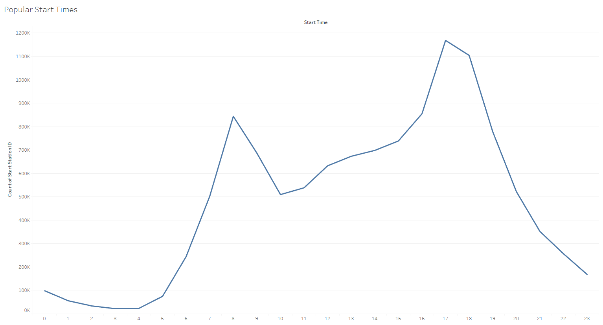
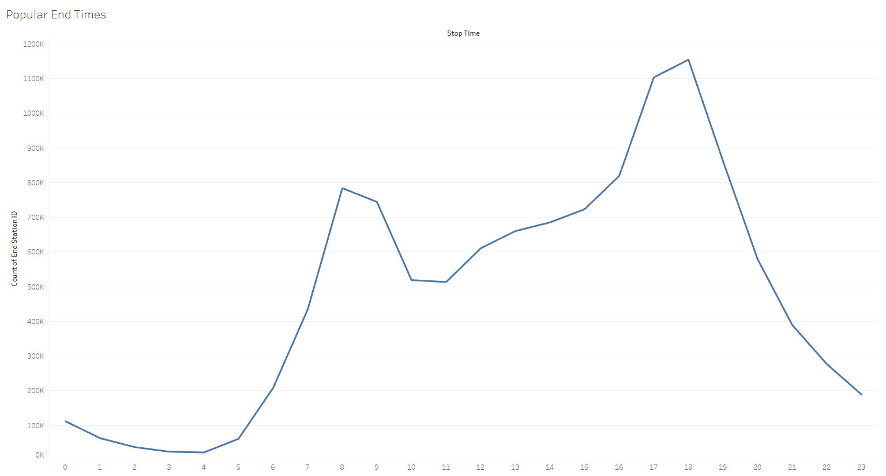
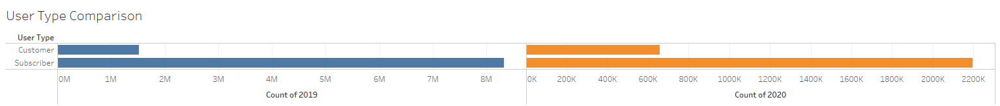
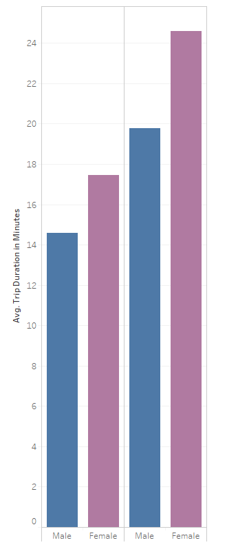

# Citi-Bike-Analytics #

Final submission should include:

A link to your Tableau Public workbook that includes:

4-10 Total "Phenomenon" Visualizations
* 2 Dashboards
* 1 City Official Map

* 1 Story
[Go to my Tableau's dashboard ](https://public.tableau.com/profile/sylvain.david#!/)

A text or markdown file with your analysis on the phenomenons you uncovered from the data.

The data shows the CitiBikes are mainly used for commuters. When we look at the Popular Starting/Ending Locations, we can observe they match the main Public transportation hubs in NYC: Grand Central, 42nd St, NJ Ferry transit etc. Also, when we observe the using time, we can deduct the bicycles are mostly used during commute times. Last but not least, the users are mainly subscribers, which means daily users. 

The study is based on the month of March, April, June, July and September of 2019 and 2020 in order to compare the before and after COVID; 2019 being the reference.
We can observe that the number of subscribers as dropped between 2019 and 2020 as well as the use of the Citibikes, especially during the confinement.

## Technologies used ##
* Python
* Tableau
* CSV file
  
## Authors ##
* Sylvain David - Data Analytics Bootcamp - Vanderbilt University - 2020